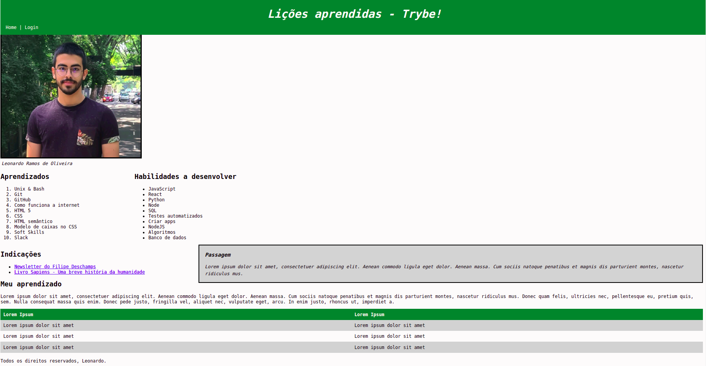

<h1 align="center">Project Lessons Learned</h1>

<p align="center">✔️ Concluded</p>

## 💻 Instalando o projeto

Clone o repositório:

```
git clone git@github.com:lramos33/project-lessons-learned.git
```

Acesse a pasta do repositório

```
cd project-lessons-learned
```

Execute o arquivo index.html


## 🚀 Habilidades

- Utilizar HTML para construir páginas WEB;
- Utilizar HTML semântico para tornar sua página mais acessível e melhor ranqueada;
- Utilizar CSS para adicionar estilo e posicionar elementos.

## 🔧 Desenvolvimento

Foi desenvolvido um site com uma série de informações sobre o que você aprendi na Trybe ao longo dos últimos três blocos. O site possui elementos posicionados e estilizados e além disto, possui semântica apropriada para que seja acessível e melhor ranqueado.



## 📝 Requisitos do projeto

- [x] 1. Adicione uma cor de fundo específica para a página;

- [x] 2. Adicione uma barra superior com um título;

- [x] 3. Adicione uma foto sua à página;

- [x] 4. Adicione uma lista de lições aprendidas à página;

- [x] 5. Crie uma lista de lições que ainda deseja aprender para a página;

- [x] 6. Adicione um rodapé para a página;

- [x] 7.Insira pelo menos um link externo na página;

- [x] 8. Crie um artigo sobre seu aprendizado;

- [x] 9. Crie uma seção que conta uma passagem sobre seu aprendizado;

- [x] 10. Aplique elementos HTML de acordo com o sentido e propósito de cada um deles;

- [x] 11. Teste a semântica da sua página está aprovada pelo site CodeSniffer.

### Requisitos bônus:

- [x] 12. Adicione uma tabela à página;

- [x] 13. Utilize o Box model;

- [x] 14. Altere atributos relacionados as fontes;

- [x] 15. Posicione o seu artigo e a seção sobre aprendizados um ao lado do outro.


##

<div align="center">
  
  
  
</div>
